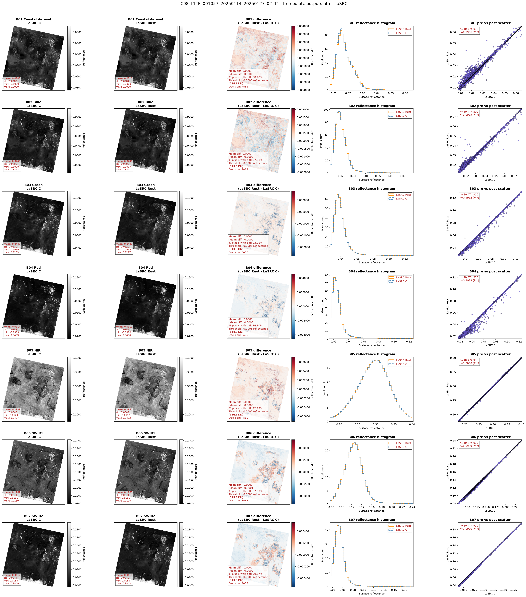
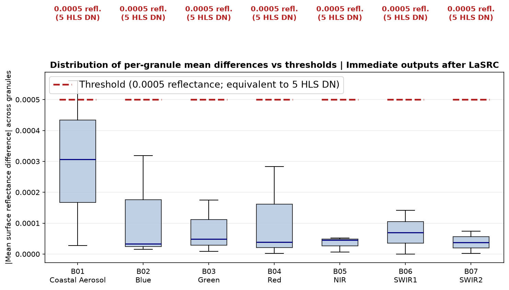
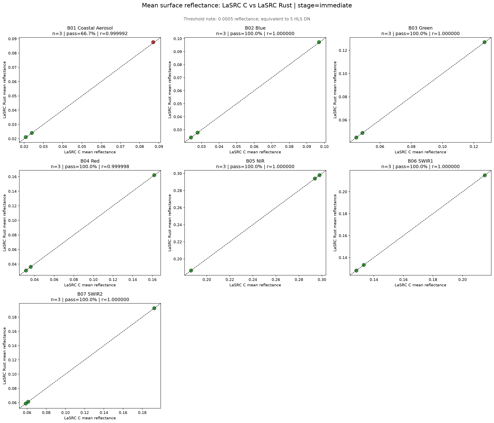

# LaSRC Container Validation

Standalone tools for comparing paired LaSRC/HLS output trees from two container builds. The shared workflow is intended for S3-backed experiments and applies the CLI's defined reference thresholds by default.

## Layout

```text
.
├── README.md
├── environment.yml
├── config/
│   └── lasrc_s3.example.json
├── docs/
│   └── examples/                    # Static, viewable example results
├── notebooks/
│   └── LaSRC_container_validation.ipynb
└── scripts/
    ├── lasrc_container_validation_cli.py
    └── run_lasrc_container_validation.py
```

- **Notebook:** visual inspection of up to 10 paired granules.
- **CLI:** reproducible, large-set comparison with reports and summary plots.
- **Config:** an S3 template. Copy it for each experiment; do not commit credentials or run-specific config files.

## Setup

From this directory:

```bash
mamba env create -f environment.yml
mamba activate lasrc_validation
```

If your terminal is using a different Conda environment, run the commands below through the validation environment explicitly:

```bash
mamba run -n lasrc_validation python scripts/run_lasrc_container_validation.py --help
```

Authenticate to AWS using your organization-approved method:

```bash
aws sso login --profile YOUR_PROFILE
```

Alternatively, export `AWS_ACCESS_KEY_ID`, `AWS_SECRET_ACCESS_KEY`, and `AWS_SESSION_TOKEN`. The identity needs `s3:ListBucket` and `s3:GetObject` permissions for both output roots.

S3 roots use `bucket/prefix/` notation, for example:

```text
YOUR-BUCKET/your-experiment/pre/
```

## Visual Review: Notebook

The notebook is configured for a small, visual review of up to 10 granules. Set
`COMPARISON_STAGE`, the input roots, and optional granule filters in its first
configuration cell for your experiment.

1. Open `notebooks/LaSRC_container_validation.ipynb` in JupyterLab or Cursor.
2. Select the `lasrc_validation` kernel.
3. In the first configuration cell, set `folder_pre`, `folder_post`, labels, and `AWS_PROFILE` if required.
4. Optionally set `GRANULE_FILTERS` to inspect particular IDs.
5. Run all cells from top to bottom.

```bash
jupyter lab notebooks/LaSRC_container_validation.ipynb
```

Figures and reports are written under `outputs/lasrc_validation/` and `reports/` relative to the notebook's parent directory.

## Large Comparison: CLI

1. Create a working config:

```bash
cp config/lasrc_s3.example.json config/my_validation.json
```

2. Edit these fields in `config/my_validation.json`:

```json
"folder_pre": "YOUR-BUCKET/path/to/pre-output/",
"folder_post": "YOUR-BUCKET/path/to/post-output/",
"pre_label": "Pre container",
"post_label": "Post container",
"aws_profile": "YOUR_PROFILE",
"output_root": "./outputs/my_validation"
```

3. Smoke test three paired granules:

```bash
python scripts/run_lasrc_container_validation.py \
  --config config/my_validation.json \
  --max-granules 3 \
  --skip-runtime-logs
```

4. Run the complete catalog after reviewing the smoke-test output:

```bash
python scripts/run_lasrc_container_validation.py \
  --config config/my_validation.json \
  --skip-runtime-logs
```

Add `--render-all-panels` only when needed. It creates a panel for every paired granule and can take substantial time and storage.

## Configuration Notes

- `data_source_mode: "s3"` reads the two S3 roots directly.
- `s3_read_mode: "cache"` stores downloaded rasters under `<output_root>/_cache/`; delete that folder after a run if needed.
- `comparison_stage` accepts `final`, `immediate`, or `auto`. Start with `final` unless both output trees retain comparable immediate files.
- `save_summary_plots: true` writes the overall summary plots for every CLI run.
- `render_single_panel: true` writes one granule panel: the configured `panel_granule`, or the first matched granule when it is `null`.
- `render_all_panels: false` is the safe default. Set it to `true`, or add the CLI flag `--render-all-panels`, to write a panel for every matched granule. This can take substantial time and storage.
- `panel_bands: []` includes every discovered band in each panel. Provide a list such as `["B01", "B02", "B03"]` to limit panels to selected bands.
- `threshold_mode: "reference"` applies the published per-band reference thresholds below. Use `custom` only for a study with an explicitly approved alternative threshold.
- Leave `runtime_log_source` as `null` unless the two datasets have comparable logs.

## Thresholds

The pass/fail statistic is the absolute value of the **per-granule mean surface-reflectance difference**. A pair passes when that value is less than or equal to its selected threshold.

### Built-In Reference Thresholds

Set the following to use the built-in reference values:

```json
"threshold_mode": "reference",
"threshold_units": "reflectance",
"threshold_global_default": null
```

| Band | Final HLS output | Immediate S30 | Immediate L30 |
|---|---:|---:|---:|
| B01 | 0.0051 | 0.0053 | 0.0053 |
| B02 | 0.0048 | 0.0056 | 0.0056 |
| B03 | 0.0055 | 0.0054 | 0.0054 |
| B04 | 0.0052 | 0.0066 | 0.0066 |
| B05 | 0.0075 | n/a | 0.0099 |
| B06 | 0.0093 | n/a | 0.0131 |
| B07 | 0.0064 | n/a | 0.0087 |
| B8A | 0.0075 | 0.0099 | n/a |
| B11 | 0.0093 | 0.0131 | n/a |
| B12 | 0.0064 | 0.0087 | n/a |

Bands not listed in the applicable column receive no reference threshold and are reported as `NO_THRESHOLD`.

### Custom 5-HLS-DN Threshold

For a C-versus-Rust equivalence test, the agreed acceptance target can be a uniform **5 HLS DN**, where final HLS reflectance uses a scale factor of `0.0001`:

```text
5 HLS DN x 0.0001 = 0.0005 reflectance
```

Use this configuration to apply that threshold to every discovered band and stage:

```json
"threshold_mode": "custom",
"threshold_units": "reflectance",
"threshold_global_default": 0.0005,
"final_output_thresholds": {},
"immediate_thresholds_s30": {},
"immediate_thresholds_l30": {}
```

Do **not** set `"threshold_units": "dn"` and `"threshold_global_default": 5` for an immediate-output comparison. In that mode, the CLI converts DN using the immediate raster encoding. For example, Landsat immediate outputs use `DN * 0.0000275 - 0.2`, so `5` would become `0.0001375`, not the intended 5-HLS-DN-equivalent threshold of `0.0005`.

## Outputs

Each run writes timestamped outputs under `output_root`:

- `reports/paired_catalog_*.csv`: discovered matching records.
- `reports/lasrc_validation_metrics_*.csv`: metrics per granule, band, and stage.
- `reports/summary_by_band_*.csv` and `overall_summary_*.csv`: aggregate results.
- `plots/`: summary figures and requested granule panels.

Notebook cell outputs are deliberately cleared before publication: they can be large,
become stale when the input roots change, and may expose local paths or credential
metadata. Run the notebook locally to create the same figures under
`outputs/lasrc_validation/`. A selected credential-free panel can also be committed
as a static documentation example when a shareable result is available.

## Example Results

The following static figures were generated by the CLI from a three-granule,
immediate-output LaSRC C-versus-Rust smoke test. They are included as lightweight,
viewable examples only; rerun the workflow for current experiment results.

### Representative Granule Panel



### Summary Plots




